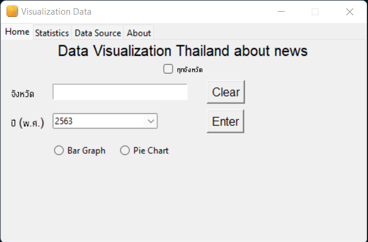

# Visualization Data Drug in thailand during 2014 to 2020 
## Data sorce from ข้อมูลเปิดภาครัฐ สำนักงาน ป.ป.ส

### Inttroducing program 
Using tkinter module for UI elemnet and use matpotlib to expand data
You can also choose Pie chart or Bar and you can see stat result in static tab

### Example program

### How it' work
1. Select All country or specific country for example กรุงเทพมหานคร,สงขลา by type name or more than 1 name to compare each province or you can clear value
2. Select Year 2014 to 2020 
3. Select Type of output Pie or Bar
4. Enter 

### Table
|stat|value|
|ค่าเฉลี่ยเลขคณิต|0|
|ค่ามัธยฐาน|0|
|ฐานนิยม|0|
|กึ่งกลางพิสัย|0|
|ค่าสูงสุด|0|
|ค่าต่ำสุด|0|
